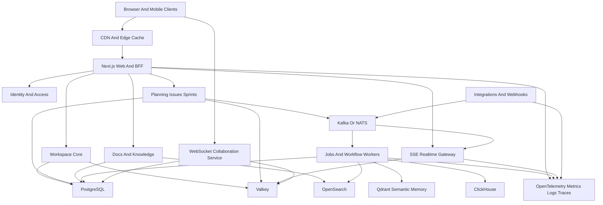
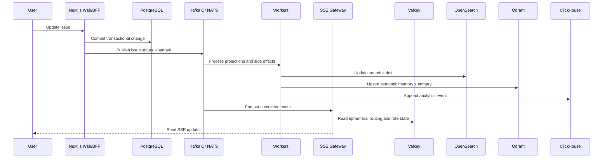

# Partha Architecture

## Purpose

This document validates Partha's current architecture against the long-term roadmap and defines the enterprise architecture direction required for high load, fast pages, strong tenant isolation, scalable realtime behavior, collaboration, integrations, analytics, AI workflows, and operational trust.

Partha is currently a workspace-scoped project management product. The roadmap expands it into an AI-ready product operating system that connects planning, issues, sprints, documentation, GitHub activity, releases, deployments, analytics, customer feedback, marketing workflows, and enterprise controls.

The current stack is a strong starting point for product velocity:

- Bun and Turborepo monorepo.
- Next.js App Router applications for product, marketing, and docs.
- React 19.
- PostgreSQL through Drizzle ORM.
- Neon/Postgres driver support.
- Better Auth.
- MCP server support.
- Current low-volume realtime updates through PostgreSQL `LISTEN/NOTIFY` and SSE.

The target architecture should not become microservices everywhere from day one. The better path is a TypeScript modular-services platform: keep the monorepo and Next.js product surface while extracting high-load domains only when scale, reliability, or ownership boundaries justify it.

## Architecture Thesis

Partha should evolve through three principles:

1. Keep the current monorepo productive while enforcing module boundaries.
2. Move expensive, bursty, and long-running workloads out of request/response paths.
3. Split infrastructure by workload type: transactional data, events, cache, search, analytics, realtime delivery, collaboration, and background jobs should not all compete inside the same database and web process.

The approved enterprise target is:

- Next.js App Router as the web and BFF layer.
- TypeScript backend services using NestJS or Fastify where independent scaling is needed.
- PostgreSQL as the transactional source of truth.
- Valkey for cache, rate limits, pub/sub, idempotency locks, ephemeral presence, and short-lived coordination.
- Kafka or NATS for durable domain events.
- Queue and workflow workers for webhooks, AI jobs, imports, notifications, changelog generation, deployment orchestration, and other long-running work.
- ClickHouse for high-volume analytics and event queries.
- OpenSearch for full-text and cross-module search.
- Qdrant for semantic memory and vector retrieval over curated incident, release, PR, testcase, approval, deployment, and postmortem evidence.
- OpenTelemetry, metrics, structured logs, traces, and dashboards for operations.

## Current Architecture Audit

### What Works Today

The current architecture is appropriate for early product development and moderate SaaS usage:

- The monorepo keeps app, site, docs, shared UI, TypeScript config, and lint config close together.
- Next.js App Router is suitable for product pages, server-rendered views, route handlers, and BFF-style data loading.
- PostgreSQL and Drizzle are good choices for relational workspace data, project planning data, auth-linked data, and transactional consistency.
- Better Auth provides a modern authentication foundation.
- MCP support is strategically important because future AI agents need structured access to product and workspace data.
- The current SSE route provides a simple low-volume realtime path for workspace updates.

### Current Shortcomings

The current architecture will hit limits as the roadmap expands:

- One product app currently carries too many future responsibilities: web UI, API behavior, realtime fanout, integration processing, dashboards, AI workflows, and long-running operations.
- PostgreSQL is used for transactional data and current realtime notification fanout. That is acceptable at low volume, but it should not become the central bus for high-volume events, webhook bursts, analytics, or collaboration.
- PostgreSQL `LISTEN/NOTIFY` is not a durable event system. Notifications can be missed by disconnected consumers and are not suitable as the source of truth for enterprise workflows.
- Long-lived SSE connections consume server resources. At enterprise scale they need a dedicated gateway, connection limits, backpressure, and operational metrics.
- There is no dedicated event bus, job queue, or workflow engine in the current baseline.
- Heavy dashboards can overload transactional Postgres if they directly scan issue, sprint, activity, release, analytics, and integration tables.
- Full-text search across issues, docs, comments, releases, feedback, and marketing content will eventually need a search index instead of ad hoc database queries.
- Future GitHub, analytics, watchdog, social, deployment, and AI integrations will create bursty workloads and external API retry behavior that should not run inside user-facing requests.
- Tenant isolation, auditability, rate limits, and data access boundaries must be treated as platform invariants before enterprise customers trust the product.

### Current Realtime Constraint

Today, workspace events are published through PostgreSQL:

- `publishWorkspaceEvent()` serializes an event and calls `pg_notify('workspace_events', payload)`.
- The workspace events route opens an SSE stream and listens to `workspace_events`.
- Each event is filtered by `workspaceId` before being sent to the client.

This is simple and useful for early workspace notifications. It should be documented as a low-volume implementation, not as the enterprise realtime architecture.

## Target Enterprise Architecture

Partha should use a modular platform architecture. The first version can live mostly inside the monorepo, but each domain should have clear ownership, APIs, data boundaries, event contracts, and extraction triggers.

### Domain Boundaries

#### Web And BFF Layer

The Next.js app should remain responsible for route composition, server component data loading, page-level authorization checks, form actions where appropriate, API facades for the web product, and user experience.

It should not become the permanent home for heavy background processing, integration retries, analytics aggregation, webhook ingestion fanout, collaboration state, or deployment orchestration.

#### Identity And Access

This domain owns users, sessions, organizations, workspaces, memberships, roles, permissions, invitations, API tokens, MCP access, and service-to-service authentication.

Enterprise target:

- RBAC for common roles.
- ABAC for contextual checks such as workspace, project, environment, repository, document, deployment, and integration scope.
- Scoped API tokens and MCP tokens.
- Audit events for sensitive access and administrative actions.
- Central authorization helpers used consistently by web, API, workers, and services.

#### Workspace Core

Workspace Core owns tenant identity, workspace settings, members, teams, shared labels, notifications preferences, and workspace-level configuration.

This domain should be treated as one of the last to extract because most other domains depend on it. The first step is strong internal boundaries, stable query helpers, and clear authorization contracts.

#### Planning, Issues, And Sprints

This domain owns projects, milestones, issues, comments, labels, dependencies, sprints, Kanban state, Gantt dates, activity, and planning dashboards.

Enterprise target:

- Transactional writes remain in Postgres.
- Expensive dashboards move to projections or analytics stores.
- Activity events are emitted for audit, realtime updates, analytics, notifications, and AI context.
- Large lists require cursor pagination, normalized search params, indexed filters, and query budgets.

#### Docs And Knowledge

This domain owns wiki spaces, BRDs, architecture notes, API docs, test plans, testcases, release notes, AI-agent instructions, and document approval workflows.

Enterprise target:

- Postgres stores canonical document metadata and versions.
- Object storage may store large assets and attachments.
- OpenSearch indexes searchable content.
- Collaboration uses WebSockets and CRDTs only for live multi-user editing.
- Approval events flow through the durable event bus.

#### Realtime Gateway

Realtime Gateway owns high-scale SSE delivery for most product events.

SSE should be the default for:

- Workspace notifications.
- Issue, sprint, project, and milestone updates.
- Activity feeds.
- Approval status changes.
- Deployment status updates.
- Dashboard refresh signals.
- Integration status notifications.

The gateway should support connection limits, workspace-level authorization, fanout from durable events, Valkey-backed ephemeral coordination, heartbeats, retry guidance, and operational metrics.

#### Collaboration Service

WebSockets should be reserved for features that need low-latency bidirectional collaboration:

- Live document editing.
- Whiteboards.
- Multiplayer cursors.
- Presence while editing.
- Pair-planning sessions.
- Future collaborative AI sessions where both client and server need rapid bidirectional state exchange.

CRDTs such as Yjs are appropriate for conflict-free document and whiteboard editing. They should not be used for normal issue status updates or transactional project management operations. Those should stay server-authoritative and emit realtime updates after committed writes.

#### Integrations And Webhooks

This domain owns GitHub, GitLab, analytics providers, Firebase, Google Analytics, social platforms, Canva, Hyperframes, deployment providers, watchdog sources, and future third-party systems.

Enterprise target:

- Webhook endpoints validate signatures and quickly enqueue work.
- Idempotency keys prevent duplicate processing.
- Workers handle external API retries, backoff, pagination, and rate limits.
- Integration credentials are isolated, encrypted, scoped, and audited.
- Integration adapters are modular so new providers do not pollute core product logic.

#### Jobs And Workflows

Jobs and workflow workers own asynchronous work:

- Webhook processing.
- GitHub sync.
- Auto changelog generation.
- AI summarization and document generation.
- Email and in-app notifications.
- Imports and exports.
- Analytics projection updates.
- Search indexing.
- Semantic memory indexing.
- Deployment orchestration.
- Watchdog monitoring.
- Scheduled maintenance.

Simple jobs can begin with a queue. Long-running, retryable, approval-driven workflows should eventually use a durable workflow engine or workflow pattern that records state, retries, compensation behavior, and human approval checkpoints.

#### Search

OpenSearch should own full-text and cross-module search across:

- Issues.
- Comments.
- Docs.
- BRDs.
- Testcases.
- Releases.
- Changelogs.
- Public feedback.
- Marketing content.
- Integration metadata.

Postgres can continue to serve exact lookups and small filtered lists. OpenSearch should handle relevance, stemming, highlighting, multi-field search, and global search across modules.

#### Semantic Memory And RAG

Qdrant should own semantic retrieval for incident-first operational memory. It should index embeddings for curated, normalized summaries rather than raw unrestricted workspace data.

Initial indexed evidence should include:

- Production symptoms, exception summaries, affected frontend paths, and incident narratives.
- Release summaries, deployment events, rollback reasons, and environment health signals.
- Pull request summaries, review decisions, failed checks, merge decisions, and owner metadata.
- Approved BRDs, testcases, workflow approvals, QA sign-off, and release readiness evidence.
- Postmortems, incident learnings, architecture decisions, and known risky modules.

Qdrant should not become the source of truth. Vector payloads should carry source references back to Postgres records, event offsets, OpenSearch documents, ClickHouse timeline rows, or integration source IDs. Retrieval results must be authorization-checked before being used in AI prompts or user-facing answers.

The retrieval split should be explicit:

- Postgres stores canonical records, relationships, permissions, workflow state, and audit trails.
- Kafka or NATS carries committed business events and enables replayable indexing.
- OpenSearch supports keyword search, filtering, highlighting, and exact text relevance.
- Qdrant supports semantic similarity over event and document summaries.
- ClickHouse supports high-volume event timelines, metrics, aggregates, and release-impact analysis.

Incident-first RAG should combine these stores. A production issue query should retrieve semantically similar events from Qdrant, exact matching records from OpenSearch, timeline context from ClickHouse, and canonical authorization and relationship data from Postgres before drafting a source-linked RCA answer.

#### Analytics

ClickHouse should own high-volume event analytics:

- Product usage.
- Feature adoption.
- Release impact.
- Dashboard metrics.
- Funnel-like product metrics.
- Event timelines.
- Aggregated integration and deployment metrics.

Transactional Postgres should not be the primary system for high-volume behavioral analytics or long-range dashboard queries.

#### Notifications

Notifications should be a domain with explicit delivery channels:

- In-app notifications.
- Email.
- Future Slack, Teams, Discord, or webhook delivery.
- Realtime notification delivery through SSE.

The notification domain should use durable events and worker queues. User-facing requests should not block on external notification delivery.

#### Billing And Entitlements

Billing and entitlements should define limits and capabilities:

- Workspace seats.
- Storage limits.
- AI usage.
- Integration count.
- Realtime connection limits.
- Webhook volume.
- Analytics retention.
- Advanced security features.

Entitlements must be checked consistently by web routes, APIs, workers, integrations, and MCP tools.

#### Deployment Agents

The roadmap includes deployment visibility and possible deployment control. Enterprise trust requires an agent model rather than broad central SSH access.

The preferred model:

- Customer runs a small deployment agent in their own infrastructure.
- Partha sends approved deployment jobs to the agent.
- The agent pulls images, executes controlled commands, streams status, and returns logs.
- Secrets stay close to the customer's infrastructure.
- Every deployment action has an approval and audit trail.

#### AI Context Services

AI features should use structured context instead of raw, unrestricted database access.

This domain owns:

- Workspace context packages.
- Project context summaries.
- Issue and doc retrieval.
- Incident-first RAG retrieval using Qdrant, OpenSearch, ClickHouse, and canonical Postgres relationships.
- Prompt-safe redaction.
- Tool permission checks.
- AI audit logs.
- Human approval checkpoints.

AI must assist, summarize, draft, and validate. Sensitive actions such as approvals, deployments, changelog publication, workflow changes, and security changes should remain human-approved.

## Data And Event Architecture

### Transactional Data

Postgres remains the source of truth for transactional data:

- Users, sessions, workspaces, memberships, roles, and permissions.
- Projects, milestones, issues, sprints, comments, and planning data.
- Document metadata, versions, approvals, and audit trails.
- Integration installation metadata and sync state.
- Release and deployment records.
- Billing and entitlement records.

Postgres scaling strategy:

- Strong indexes for workspace-scoped access paths.
- Tenant-aware query patterns.
- Cursor pagination for large lists.
- Query budgets for route handlers and server components.
- Read replicas for read-heavy workloads when consistency requirements allow.
- Partitioning candidates for high-volume tables such as activity, audit logs, notifications, event inboxes, and integration events.
- Archival policies for cold data.

### Durable Events

Kafka or NATS should become the durable event backbone once integrations, workers, analytics, notifications, and realtime fanout outgrow direct database coupling.

Domain events should represent committed business facts:

- `issue.created`
- `issue.status_changed`
- `sprint.started`
- `document.approved`
- `pull_request.merged`
- `release.created`
- `deployment.completed`
- `feedback.triaged`

Durable events should be used for fanout, replay, projections, analytics ingestion, notifications, indexing, and audit support. They should not replace transactional writes where strong consistency is required.

### Event Flow

### Valkey Responsibilities

Valkey should be used for data that is hot, ephemeral, or coordination-oriented:

- Workspace metadata cache.
- Permission and entitlement cache with short TTLs.
- Rate limit counters.
- Idempotency locks.
- Webhook deduplication windows.
- SSE routing coordination.
- Presence state.
- Short-lived collaboration metadata.
- Pub/sub where durable replay is not required.

Valkey should not become the source of truth for core product records, audit logs, approvals, deployment history, billing records, or security-sensitive permanent state.

### Analytics Store

ClickHouse should be introduced when dashboards and product analytics require high-volume scans, time-series rollups, or long-retention event queries.

Examples:

- Sprint throughput over time.
- Release impact by feature.
- Production usage after deployment.
- Integration event volume.
- Public feedback trends.
- Marketing campaign performance.

Postgres can retain the source records. ClickHouse should store event-shaped copies and aggregate tables optimized for analytics.

### Search Index

OpenSearch should index denormalized search documents built by workers from durable events or scheduled reindexing.

Search index documents should include tenant and access metadata so queries can enforce workspace and permission boundaries. Search results should still be authorization-checked before exposing sensitive content.

### Semantic Memory Index

Qdrant should index embedding vectors produced from approved, redacted, and normalized summaries. This keeps semantic retrieval useful while avoiding direct embedding of noisy raw logs, secrets, or unapproved private content.

Each vector payload should include:

- Workspace ID and tenant isolation metadata.
- Project ID, repository ID, service ID, environment ID, or release ID when available.
- Source entity type and source record ID.
- Durable event name, event ID, event timestamp, and event schema version when the vector came from an event.
- Visibility scope and permission metadata required for authorization filtering.
- Embedding model name and version.
- Source checksum or content version so stale vectors can be detected.
- Retention class and deletion policy.

Qdrant queries should always be scoped by tenant and permission metadata before source content is shown. Retrieved vector matches should be treated as candidates, not facts, until the canonical source records are loaded and checked.

## Load Handling And Scaling Strategy

### Primary Load Risks

The roadmap creates several different load profiles:

- Interactive product pages: low latency, strong authorization, predictable reads.
- Boards and Gantt views: high query complexity and frequent updates.
- Dashboards: expensive aggregation and historical queries.
- Realtime updates: long-lived connections and fanout.
- Webhooks: bursty ingestion, retries, and duplicate events.
- AI jobs: slow, expensive, asynchronous work with approval requirements.
- Search: cross-module indexing and relevance queries.
- Semantic memory: embedding generation, vector upserts, hybrid retrieval, and source-grounded incident RCA answers.
- Analytics: high-volume append and aggregation.
- Deployment orchestration: sensitive long-running operations.
- Public feedback and watchdog monitoring: external API limits and noisy input.

Each profile needs a different scaling mechanism. The architecture should avoid sending all workloads through the same Next.js route handlers and transactional database queries.

### Query Budgets

Every high-traffic route should have a query budget:

- Number of database round trips.
- Expected p95 latency.
- Maximum rows scanned.
- Required indexes.
- Pagination requirements.
- Cache eligibility.
- Consistency requirements.

Pages that cannot meet their budget with direct transactional queries should use projections, denormalized read models, or analytics stores.

### Database Scaling

Postgres should scale through disciplined data access before service extraction:

- Keep every multi-tenant query scoped by `workspaceId` or an equivalent tenant key.
- Use composite indexes that match real route filters.
- Prefer cursor pagination for large and frequently changing lists.
- Avoid unbounded joins in dashboard and search paths.
- Use read replicas for read-heavy, stale-tolerant screens.
- Use partitioning for very large append-heavy tables.
- Store large blobs and assets outside Postgres.
- Add query observability before guessing at bottlenecks.

### Dashboard Scaling

Dashboards should not be built by repeatedly aggregating large transactional tables at request time.

Use:

- Incremental projections updated by workers.
- Materialized summary tables for operational dashboards.
- ClickHouse for product analytics and long-range trends.
- Cache invalidation through domain events.
- Clear freshness indicators when data is eventually consistent.

### Integration Burst Handling

Webhook endpoints should do the minimum synchronous work:

1. Authenticate the request.
2. Verify signature.
3. Record or deduplicate event receipt.
4. Enqueue the work.
5. Return quickly.

Workers should handle parsing, API calls, retries, rate limits, and domain updates. This prevents GitHub, analytics, social, or deployment provider bursts from degrading the main product.

## Page Speed, Caching, And Frontend Performance

### Page-Speed Goals

Partha should define budgets rather than vague "fast enough" goals:

- p95 route response targets for key workspace pages.
- Core Web Vitals budgets for product, marketing, and docs surfaces.
- Maximum JavaScript budget per route group.
- Maximum number of blocking queries per page.
- Maximum server action and route handler latency for common actions.
- Maximum table/list payload size before pagination is required.

Exact numbers should be set after baseline measurement. The architecture should require measurement first and optimization second.

### Rendering Strategy

Use server-first rendering for stable, permissioned product data:

- Workspace shell.
- Project overview.
- Issue detail initial state.
- Sprint detail initial state.
- Docs metadata.
- Dashboards backed by projections.

Use client components only where interaction requires them:

- Kanban drag and drop.
- Gantt interaction.
- Rich text editing.
- Realtime collaboration.
- Complex filters.
- Interactive charts.

### Caching Layers

Caching should be explicit by data type:

- CDN and edge cache for public marketing, docs, static assets, images, and public changelogs.
- Next.js caching for stable public or semi-static data where invalidation is clear.
- Valkey for hot workspace metadata, permission summaries, entitlement checks, rate limits, and short-lived read models.
- Browser cache for static assets and safe client-side data.
- ClickHouse and projections for analytics-style read optimization.

Cache invalidation should be driven by domain events where possible. Manual ad hoc cache clearing should be avoided for core product data.

### Large Lists

Large lists need stable conventions:

- Cursor pagination.
- Search-param normalization.
- Indexed filters.
- Server-side sorting with explicit allowed fields.
- Avoid loading full workspaces into client state.
- Use virtualized rendering only after server payloads are already bounded.

## Realtime And Collaboration Architecture

### SSE-First Realtime

SSE should be the default realtime mechanism because most Partha realtime updates are server-to-client notifications after committed business changes.

Use SSE for:

- Workspace notifications.
- Issue and sprint updates.
- Project and milestone changes.
- Activity feed updates.
- Approval state changes.
- Deployment status updates.
- Integration sync status.
- Dashboard refresh signals.
- Changelog and release updates.

SSE advantages:

- Simple browser support.
- Automatic reconnection.
- Works well for one-way server-authoritative updates.
- Easier operational model than WebSockets for most product notifications.

Enterprise SSE requirements:

- Dedicated realtime gateway service.
- Authenticated connection setup.
- Workspace and channel authorization.
- Heartbeats.
- Backpressure.
- Per-tenant connection limits.
- Connection metrics.
- Replay or catch-up through durable event offsets where needed.
- Valkey for ephemeral routing, coordination, and rate state.
- Kafka/NATS as the durable event source, not the SSE connection itself.

### WebSockets For Collaboration Only

WebSockets should be reserved for bidirectional collaborative features:

- Live document editing.
- Whiteboards.
- Multiplayer cursors.
- Presence while editing.
- Pair-planning sessions.
- Future AI collaboration sessions that need rapid bidirectional exchange.

Collaboration state should be separated from normal product transactions. For rich text and whiteboards, use CRDTs such as Yjs. Persist snapshots and document versions to durable storage. Use server-authoritative writes for normal issue, sprint, release, approval, and deployment state.

### Current Implementation Migration

The current PostgreSQL `LISTEN/NOTIFY` plus SSE implementation can remain for early low-volume workspace updates. It should evolve in stages:

1. Add connection metrics, authorization checks, and clearer event types.
2. Add Valkey for ephemeral fanout and connection coordination.
3. Add durable events for committed business changes.
4. Move SSE delivery to a dedicated realtime gateway.
5. Add WebSocket collaboration service only when live editing requires it.

## Security, Tenant Isolation, And Enterprise Trust

### Tenant Isolation

Workspace isolation must be a platform invariant. Every route, query, worker, event, cache key, search document, analytics row, and realtime channel must carry tenant context.

Required practices:

- Tenant-scoped database access helpers.
- Authorization checks close to data access.
- Workspace-aware cache keys.
- Workspace-aware event schemas.
- Workspace-aware search filters.
- Workspace-aware Qdrant collections or payload filters with permission metadata.
- Tenant fields in logs, metrics, traces, and audit records.
- Tests for cross-tenant access failures.

### Access Control

Use RBAC for common roles and ABAC for contextual decisions.

Examples:

- A project admin can manage project settings only inside their workspace.
- A developer can view deployment logs only for authorized projects and environments.
- A marketer can draft release content but may need approval before publishing.
- An AI tool can read selected issue context but cannot deploy, approve, or publish without explicit permission.

Authorization must be shared by web routes, backend services, workers, integrations, and MCP tools.

### Audit Logs

Enterprise customers will expect complete auditability for:

- Login and session events.
- Membership and role changes.
- API token creation and revocation.
- Integration installation and credential changes.
- Document approvals and rejections.
- Release approvals.
- Deployment actions.
- Security settings.
- AI-generated recommendations and accepted actions.
- Data export and deletion events.

Audit logs should be append-only from the application perspective and designed for retention, filtering, and export.

### Secrets And Integration Credentials

Secrets must be isolated and encrypted:

- Store provider tokens and deployment credentials separately from ordinary product data.
- Encrypt credentials at rest.
- Scope credentials by workspace, project, provider, and environment.
- Avoid broad central SSH access for customer infrastructure.
- Prefer deployment agents for sensitive infrastructure actions.
- Audit secret usage and rotation.

### Encryption And E2EE Scope

Use encryption at rest for platform data and selective field-level encryption for sensitive fields.

Future enterprise features may include customer-managed keys for selected data classes.

Blanket end-to-end encryption should not be the default architecture because it conflicts with:

- Server-side search.
- AI assistance.
- Indexing.
- Analytics.
- Workflow automation.
- Approval and audit features.

The correct model is scoped E2EE or high-security modes for selected sensitive fields, documents, or enterprise workspaces where the customer accepts reduced search, AI, and automation capabilities.

### Rate Limits And Abuse Controls

Rate limits should apply to:

- Login and auth flows.
- API routes.
- MCP tools.
- Webhook endpoints.
- Search.
- AI jobs.
- Realtime connections.
- Collaboration sessions.
- Public feedback submission.

Valkey should back rate counters and short-lived abuse controls. Durable audit events should record security-relevant violations.

### Backup, Restore, And Disaster Recovery

Enterprise architecture requires documented recovery expectations:

- Database backup schedule.
- Point-in-time recovery target.
- Object storage backup policy.
- Search and analytics reindex strategy.
- Event bus retention and replay policy.
- Disaster recovery runbooks.
- Restore testing cadence.

Do not claim enterprise readiness until restores are tested, not just configured.

## Observability And Operations

### Observability Baseline

Every major path should emit:

- Structured logs with correlation IDs.
- Workspace and tenant context.
- Request IDs.
- User or service actor IDs where safe.
- Metrics for latency, errors, throughput, queue depth, and retries.
- Distributed traces across web, services, workers, event consumers, and external provider calls.

OpenTelemetry should be the common instrumentation model.

### Critical Metrics

Track:

- Web route p50, p95, and p99 latency.
- Database query latency and slow queries.
- Cache hit rate.
- Event bus publish and consumer lag.
- Worker queue depth and retry counts.
- Webhook ingestion success and duplicate rate.
- SSE active connections, reconnects, send failures, and per-tenant fanout.
- WebSocket collaboration sessions and sync errors.
- Search indexing lag.
- Analytics ingestion lag.
- AI job cost, latency, and failure rate.
- Deployment job duration and failure rate.

### SLOs

Define SLOs for:

- Login and auth.
- Workspace page load.
- Issue update latency.
- Realtime notification delivery.
- Webhook processing delay.
- Search freshness.
- Dashboard freshness.
- Deployment status visibility.
- Notification delivery.

SLOs should include error budgets and incident response expectations.

### Load Testing

Load tests should model real product behavior:

- Many workspaces with uneven tenant sizes.
- Large projects with many issues and comments.
- Concurrent board and sprint updates.
- Dashboard reads during active writes.
- GitHub webhook bursts.
- SSE connection fanout.
- Collaboration sessions.
- AI job bursts.
- Search indexing during imports.

Avoid claiming capacity without benchmarks. The architecture should require baseline tests, regression tests, and capacity reviews before enterprise commitments.

## Phased Evolution Roadmap

### Phase 0: Baseline And Constraints

Goal: know what the current system can support.

Actions:

- Document current request paths, data flows, and realtime behavior.
- Add baseline metrics for route latency, query latency, and build health.
- Identify top database queries by frequency and cost.
- Define tenant isolation invariants.
- Define page-speed budgets and initial SLO candidates.
- Mark PostgreSQL `LISTEN/NOTIFY` realtime as low-volume only.

### Phase 1: Harden The Current Monorepo

Goal: make the existing architecture safer before adding infrastructure.

Actions:

- Strengthen workspace-scoped authorization helpers.
- Add query budgets to high-traffic pages.
- Add pagination and index review for large lists.
- Standardize route-level data loading patterns.
- Add structured logs and request correlation IDs.
- Add audit events for sensitive operations.
- Add rate limits for auth, API, MCP, and public endpoints.

### Phase 2: Add Valkey And Background Jobs

Goal: remove hot-path and long-running work from user requests.

Actions:

- Introduce Valkey for cache, rate limits, idempotency, and ephemeral coordination.
- Add worker queues for webhook processing, notifications, imports, AI jobs, search indexing, and changelog generation.
- Add idempotency keys for webhooks and external events.
- Move external API retries into workers.
- Add queue metrics and retry policies.

### Phase 3: Add Durable Events And Projections

Goal: create a reliable backbone for fanout, analytics, notifications, and read models.

Actions:

- Introduce Kafka or NATS for durable domain events.
- Define event naming and schema versioning.
- Publish events after committed transactional writes.
- Build projections for dashboards and notifications.
- Add event consumer lag metrics.
- Add replay strategy for projections.

### Phase 4: Realtime Gateway And Collaboration

Goal: scale realtime without coupling every client connection to the web app and database.

Actions:

- Move SSE delivery to a dedicated realtime gateway.
- Use durable events for business updates.
- Use Valkey for ephemeral routing, presence metadata, and fanout coordination.
- Add per-tenant connection limits and backpressure.
- Keep WebSockets separate and only for collaboration.
- Introduce CRDT-based collaboration for docs or whiteboards when product requirements demand it.

### Phase 5: Search And Analytics Scale

Goal: prevent dashboards, global search, and incident-first retrieval from overloading transactional Postgres.

Actions:

- Introduce OpenSearch for full-text and cross-module search.
- Introduce Qdrant for semantic memory and vector retrieval over curated incident, release, PR, testcase, approval, deployment, and postmortem evidence.
- Introduce ClickHouse for event analytics and long-range dashboards.
- Build search indexing, semantic memory indexing, and analytics ingestion workers.
- Add index freshness and ingestion lag metrics.
- Keep authorization checks in search and semantic retrieval results.

### Phase 6: Extract Selected TypeScript Services

Goal: extract services only when boundaries and load justify it.

Extraction candidates:

- Integrations and Webhooks service.
- Realtime Gateway service.
- Collaboration service.
- Jobs and Workflow service.
- Search indexing service.
- Semantic memory indexing and retrieval service.
- Analytics ingestion service.
- Deployment Agent control plane.
- AI Context service.

Extraction triggers:

- Independent scaling need.
- Different uptime or latency profile.
- Operational risk to the main web app.
- Separate ownership boundary.
- Heavy external API retries.
- Long-running workload.
- Security boundary.

### Phase 7: Enterprise Hardening

Goal: become credible for serious enterprise adoption.

Actions:

- Mature RBAC and ABAC.
- Complete audit coverage.
- Add customer-managed key strategy for selected data.
- Add compliance evidence collection.
- Formalize backup, restore, and DR testing.
- Add incident response runbooks.
- Add deployment-agent trust model and security review.
- Add advanced tenant isolation tests.
- Validate HA and regional strategy.

## Technology Decision Summary

| Area                   | Recommended Direction  | Why                                                                                                |
| ---------------------- | ---------------------- | -------------------------------------------------------------------------------------------------- |
| Web and BFF            | Next.js App Router     | Keeps current productivity and fits product UI needs.                                              |
| Service language       | TypeScript             | Matches current stack and avoids premature polyglot complexity.                                    |
| Backend framework      | NestJS or Fastify      | Gives clearer service boundaries when extraction is needed.                                        |
| Transactional data     | PostgreSQL             | Strong relational model for workspace, planning, docs, auth, and audit data.                       |
| Cache and coordination | Valkey                 | Handles hot ephemeral data, rate limits, locks, and pub/sub without making Postgres do everything. |
| Durable events         | Kafka or NATS          | Supports replayable fanout, integrations, workers, analytics, and notifications.                   |
| Workers                | Queue/workflow workers | Keeps slow and retryable work out of user-facing requests.                                         |
| Analytics              | ClickHouse             | Optimized for high-volume event analytics and dashboard queries.                                   |
| Search                 | OpenSearch             | Better fit for full-text, relevance, and cross-module search.                                      |
| Semantic memory        | Qdrant                 | Supports incident-first vector retrieval over source-linked operational evidence.                  |
| Default realtime       | SSE                    | Fits server-authoritative product updates with simpler operations.                                 |
| Collaboration realtime | WebSockets             | Required only for bidirectional low-latency collaboration.                                         |
| Observability          | OpenTelemetry          | Common instrumentation across web, services, workers, and integrations.                            |

## Architectural Guardrails

- Do not extract services before module boundaries are clear.
- Do not use Postgres as a durable event bus.
- Do not run webhook processing, AI jobs, deployment orchestration, or analytics aggregation inside user-facing requests.
- Do not build dashboards directly on large transactional scans.
- Do not use Qdrant as the source of truth for incidents, approvals, releases, testcases, or audit evidence.
- Do not let RAG answers bypass authorization, source loading, redaction, or human approval gates.
- Do not present semantic similarity as proven causality without source-linked evidence.
- Do not use WebSockets for ordinary notifications that SSE can handle.
- Do not introduce blanket E2EE where the product requires server-side search, AI, automation, and analytics.
- Do not claim enterprise readiness without audit logs, tenant isolation tests, backup/restore testing, observability, rate limits, and incident runbooks.

## Immediate Next Steps

The next architecture work should be validation-oriented:

1. Map the current product data flows and request paths.
2. Identify the highest-risk pages and queries.
3. Define workspace tenant isolation tests.
4. Add route and query performance baselines.
5. Decide the first Valkey use cases: rate limits, idempotency, and hot workspace metadata.
6. Decide the first background worker use cases: webhooks, notifications, AI jobs, and indexing.
7. Define the first durable domain events for issues, sprints, docs, and integrations.
8. Define the first semantic memory candidates for incident-first RAG: production symptoms, deployment events, PR summaries, approval evidence, testcase evidence, and postmortems.
9. Add observability before major extraction so future decisions are based on evidence.
