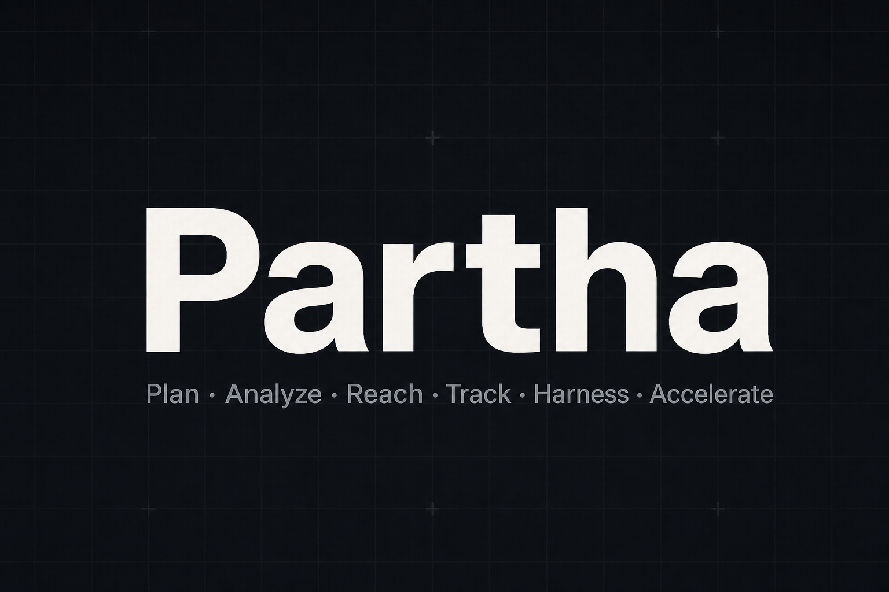

# Partha



**Plan • Analyze • Reach • Track • Harness • Accelerate**

Partha is workspace-scoped delivery software: teams, projects, milestones, and issues in one place, with a **Model Context Protocol (MCP)** server so agents can work alongside your workspace. See the [domain model](http://localhost:4002/docs/concepts/overview) for how scopes nest inside a workspace.

## Features

- Workspaces, teams, projects, milestones, issues, notifications, and realtime updates
- Next.js App Router, React 19
- [Bun](https://bun.sh/) package manager and scripts
- [Turborepo](https://turbo.build/) monorepo
- PostgreSQL via [Drizzle ORM](https://orm.drizzle.team/)
- Authentication with [Better Auth](https://www.better-auth.com/)
- MCP for OAuth, scoped tools, and programmatic access

## Monorepo layout

| Package | Path | Role |
|--------|------|------|
| `@partha/app` | `apps/app` | Main product (default dev server **port 4000**) |
| `@partha/site` | `apps/site` | Marketing site (default dev server **port 4001**) |
| `@partha/docs` | `apps/docs` | Product documentation (default dev server **port 4002**) |
| `@workspace/ui` | `packages/ui` | Shared shadcn/ui-style components |
| `@workspace/eslint-config` | `packages/eslint-config` | Shared ESLint config |
| `@workspace/typescript-config` | `packages/typescript-config` | Shared TypeScript config |

## Quick start

```bash
git clone https://github.com/Skndan/partha.git
cd partha
bun install
```

Copy env and prepare the database as described in **[Getting started](http://localhost:4002/docs/getting-started)**:

```bash
cp .env.example apps/app/.env.local
```

Set at least `DATABASE_URL`, `BETTER_AUTH_SECRET`, `BETTER_AUTH_URL`, and `NEXT_PUBLIC_URL` in `apps/app/.env.local`.

Run all apps via Turborepo:

```bash
bun dev
```

Run a single app:

```bash
bun run dev:app   # @partha/app → http://localhost:4000
bun run dev:site  # @partha/site → http://localhost:4001
bun run dev:docs  # @partha/docs → http://localhost:4002
```

## Documentation

Product docs are served by **[@partha/docs](apps/docs)** (Fumadocs). Run `bun run dev:docs` and open [http://localhost:4002/docs](http://localhost:4002/docs). Edit content under [`apps/docs/content/docs/`](apps/docs/content/docs/).

Contributor and deployment guides remain in [`docs/`](docs/) on GitHub: [contributing](docs/contributing.md), [security](docs/security.md), [deploy](docs/deploy.md), [CI/CD](docs/cicd.md).

## Contributing & security

- **[Contributing](docs/contributing.md)** — commits, Bun-only deps, UI conventions, MCP doc updates
- **[Security](docs/security.md)** — auth, sessions, MCP tokens
- **[Deploy](docs/deploy.md)** — Docker / TLS deployment
- **[CI/CD](docs/cicd.md)** — path-scoped GitHub Actions pipelines per app

## License

[MIT](LICENSE)

Repository: **https://github.com/Skndan/partha**
